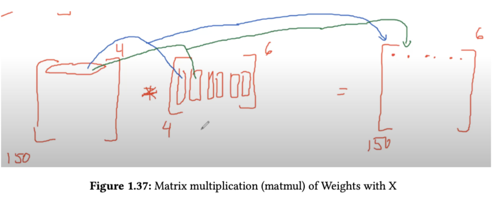

## How LLMs Work

* AGS
* How LLMs work under the hood

## Link

* https://github.com/rcalix1/DeepLearningAlgorithms/tree/main/SecondEdition/Chapter10_Transformers/GPTs
* 

## Matrix Multiplication




# 🧠 LLMs Under the Hood: Understanding Attention in Transformers

This repository walks through the **Attention Mechanism** at the core of Transformer models like GPT, BERT, and LLaMA — implemented from scratch in PyTorch.

---

## 📌 Objective

Implement and visualize how **Queries (Q)**, **Keys (K)**, and **Values (V)** are derived from token embeddings, how dot-product attention is computed, and how **causal masking** enables autoregressive behavior.

---

## 🔄 Workflow Overview

### 1. Input Tensor

We simulate a batch of 32 sequences, each 40 tokens long, with an embedding size of 512.

```python
x = torch.randn(32, 40, 512)
```

---

### 2. Compute Q, K, V Projections

We use learned projection weights and biases to map the input embeddings into lower-dimensional representations:

```python
Q = x @ wq + bq  # shape: (32, 40, 64)
K = x @ wk + bk
V = x @ wv + bv
```

---

### 3. Compute Attention Scores

We compute dot-product attention by multiplying Q and the transpose of K:

```python
attention_scores = Q @ K.transpose(-2, -1)  # shape: (32, 40, 40)
```

This measures how much each token should attend to others in the sequence.

---

### 4. Apply Causal Masking

To prevent the model from looking ahead (important in autoregressive models like GPT), we apply a lower-triangular mask:

```python
tril = torch.tril(torch.ones(40, 40))
attention_scores = attention_scores.masked_fill(tril == 0, float('-inf'))
```

---

### 5. Softmax Over Attention Scores

We convert scores into normalized attention weights:

```python
attention_probs = F.softmax(attention_scores, dim=-1)
```

---

### 6. Compute Weighted Output

We perform a weighted sum over the values `V` using attention weights:

```python
out = attention_probs @ V  # shape: (32, 40, 64)
```

---

### 7. Simulate Multi-Head Attention

We simulate 8 attention heads by replicating the output and concatenating across the feature dimension:

```python
out_cat = torch.cat([out] * 8, dim=-1)  # shape: (32, 40, 512)
```

---

### 8. Final Output Projection

We map the concatenated output back to the original embedding dimension:

```python
z = out_cat @ w0 + b0  # shape: (32, 40, 512)
```

---

## 🧠 Key Concepts

* **Self-Attention**: Enables each token to attend to others.
* **Causal Masking**: Ensures left-to-right generation.
* **Multi-Head Attention**: Captures diverse relationships in parallel.
* **Learned Projections**: Linear transformations to Q, K, and V spaces.

---

## 💪 How to Run

Install PyTorch:

```bash
pip install torch
```

Then run the script:

```bash
python attention_demo.py
```

---

## 📚 Recommended Reading

* [Attention is All You Need (Vaswani et al., 2017)](https://arxiv.org/abs/1706.03762)


---

## 🎓 About

This material is part of the **"LLMs Under the Hood"** masterclass — a 90-minute session designed for engineers and data scientists who want to deeply understand how Transformers work.
